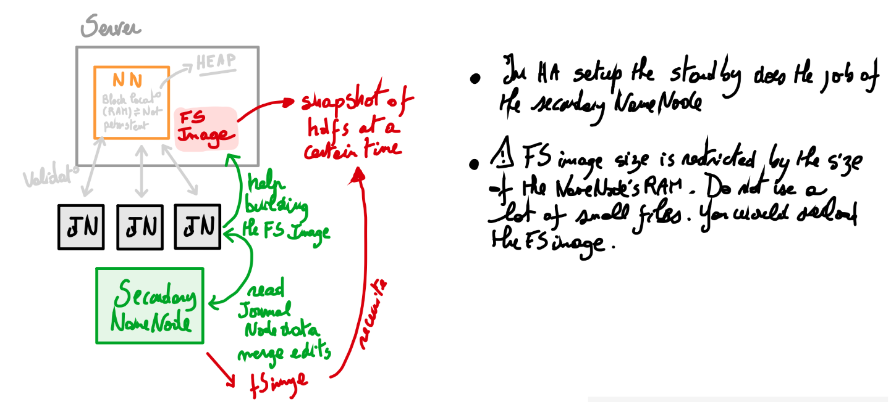

# Hadoop fundamentals

<b>Apache Hadoop</b> is a tighly integrated ecosystem of different software products built to provide scalable and reliable dsitributed storage and distributing processing. The technical foundations of Hadoop stem from successive innovative approaches proposed and published by Google in the 2000's to produce:

- reliable storage (Google file system with become Hadoop Distributed File System, `HDFS`)
- reliable processing (`MapReduce`)
- low-latency random access queries on hundreds to thousands unreliable servers

The key innovation in this approach was to distribute data and split-up computations on this data in small chunks over different machines / servers. By design distributed system scales very well. As each machine is independent scaling the infrastructure only consists of adding some servers (horizontal scaling).

Distributed systems are:
- *Scalable*
- *Open* (easy to modify the features)
- *Heterogeneous*, meaning it can deal with several different type of data:
    - structured data (RDBMS, strongly typed with fixed schema)
    - Semi-structured data (JSON, XML, NoSQL databases)
    - Unstructured data (images, sound or videos)
- Permit to ensure the 3 main **V** on Big Data: *volume*, *velocity* and *variety*
- However distributed systems are *hard to set up* and *complex to maintain and deploy*

##  The Hadoop ecosystem

Hadoop is an open source implementation of these techniques. At its core, it offers a distributed file system (HDFS) and a means of running processes across a cluster of servers (YARN, Yet Another Ressource Manager). The original distributed processing application built on Hadoop was MapReduce, but since a wide range of additionnal software frameworks and librairies have emerged around Hadoop.

## What is a cluster?

A cluster is a bunch of servers grouped together to provide one or more functions such as storage or computation. On Hadoop clusters are deployed following a <b>master / slaves (or workers)</b> architecture. Slaves machines are where the real work happens - these machines store data, perform computations, offer services like lookups and search and much more. Master machines are responsible for coordination, maintaining metadata about the data and services on the slaves machines and ensuring that the services keep running even if some slaves machines fail. Typically there are two or three master machines for redundancy to avoid any single point of failure. A cluster is scaled up by adding more slave servers. Often we want to allow access to the clusters by users by providing some machines to act as <i>gateway</i> or <i>edge</i> servers. These servers often do not run any services at all but provide access cluster services.

## Core Components

<b>HDSF</b>, <b>YARN</b>, <b>Apache ZooKeeper</b> and the <b>Apache Hive Metastore</b> represent the core building blocks of the Hadoop infrastructure.

### HDFS

 The Hadoop distributed file system is the scalable, fault-tolerant file system for Hadoop. It is optimized to store very large amount of <b>immutable</b> data (<i>Write Once Read Many</i>) with files being typically accessed in long sequential scan. When storing data, HDFS breaks up a file into <i>blocks</i> of configurable size, usually 128MB and store <i>replicas</i> of each block on multiple servers ensuring data resilience and parallelism. Each worker node runs a deamon called a <b>DataNode</b> which accepts new block of data and write them to its local disks. The <b>DataNode</b> is only aware of blocks and their IDs: it does not have the knowledge about the file to which a particular block or replicate belongs. This information is hold by the <b>NameNode</b> which runs on the master servers and is responsible for maintaining a mapping of files to the blocks as well as metadata about the files themselves (names, permissions, attributes). All this data is saved in memory and is by definition non-persistent.

 It is also possible to run a <i>secondary NameNode</i> which despite its name does not act as the primary NameNode. Its main role is <b>to keep a copy of the File System image of the primary NameNode</b> which contains all details and metadata. This image is periodically built and updated by the <i>secondary NameNode</i> through interaction with the <i>JournalNodes</i> which contains all the logs related to the primary NameNode operations. The secondary NameNode runs on a separate machine as it requires CPU power and as much memory as the NameNode.

### HDFS high availability

The combination of replicating NameNode data and using secondary NameNode to create checkpoints do protect against data loss but <b>do not provide high availability of the file system</b>. In this configuration the primary NameNode is still a <b>single point of failure</b>. If the primary NameNode fails all clients would be unable to read or write data. In such an event the whole Hadoop system would be out of service until a new NameNode is brought online.

 Since Hadoop 2 there is now the implementation of a pair of NameNodes in an <b>active-standby</b> configuration. In case of the failure of the active primary NameNode, the standby takes over and ensure continuity of services. To reach this goal a few consideration have to be taken:

- The standby NameNode synchronizes its state with the active NameNode and continues to read new entries.
- DataNodes must send block reports to both NameNodes because the block mapping are stored in memory and not on disk.
- We must ensure that only one NameNode is in active state to avoid any split / brain scenario (thank to *ZooKeeper*).
- The standby also ensure the role of the secondary NameNode by taking periodic checkpoints of the active NameNode state.

### Practice with Labs

In the <i>practice with labs</i> section you will find a link toward some practice. The lab consists of a set of instructions that you can do by yourself or with help from the walk-through which is my solution for the lab. All the labs have been performed in the frame of the Data Engineering applied master proposed by the Data SicenceTech institute. These were possible with the help of a consulting company Adaltas which provided us access to a Hadoop cluster. If you do not have access to such service you can still follow the walk-through and these notes to get an idea about the way the Hadoop infrastructure and services work. The general setup for the lab looks as depicted in the figure below. We basically connect by SSH and through VPN to an <b>edge node</b> from which we can perfom local operations and send HDFS-related operations.

You can access the LAB1 [here]().

>PUT THE LINK

### YARN

 Apache YARN (<b>Yet</b> <b>A</b>nother <b>R</b>esource <b>N</b>egotiator). is the cluster resource manager of Hadoop that was introduce in Hadoop 2. It provides an API to resquest and work with cluster resources. Nevertheless these API are abstracted from the user code. Instead a typical user will leverage some high-level APIs providing by some distributed frameworks that are built on top of YARN. Among others MapReduce, Spark, Tez or Hive are examples of computing frameworks running as YARN applications on the compute layer (provided by YARN) and the storage layer (provided by HDFS). 
There is also a extra layer of applications that build on top of these frameworks. For example <i>Pig</i> and <i>Hive</i> run on MapReduce, Spark or Tez and don't directly interact with YARN.
 

#### YARN 